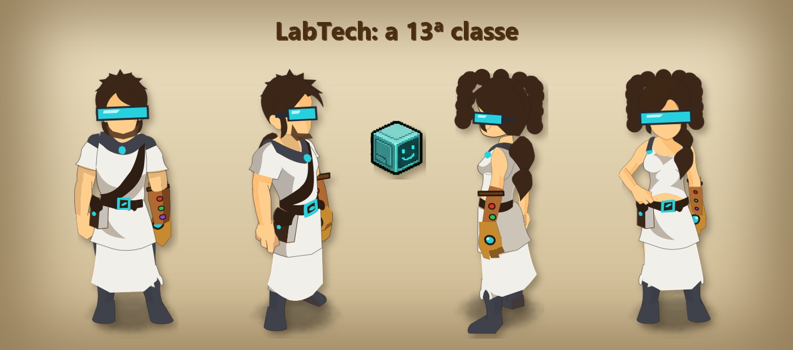
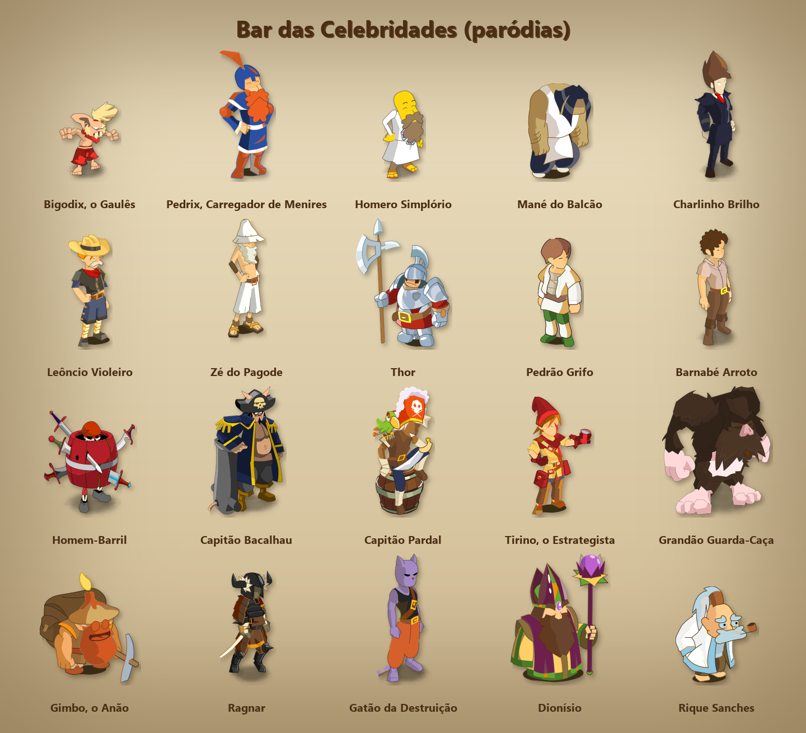
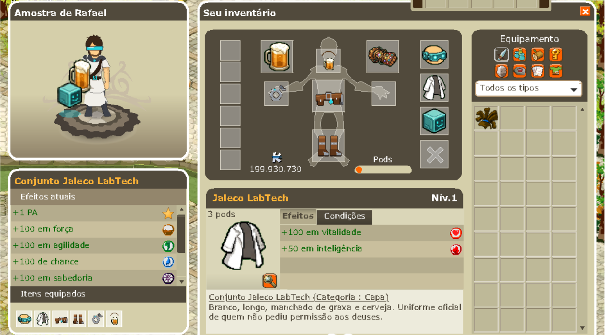
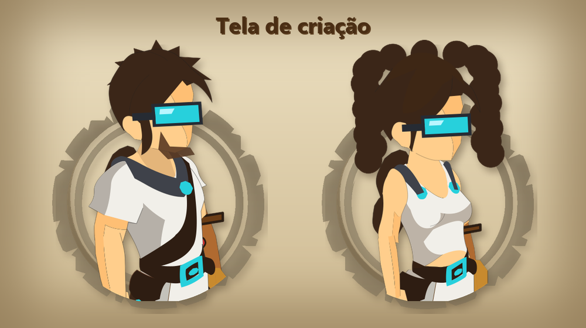
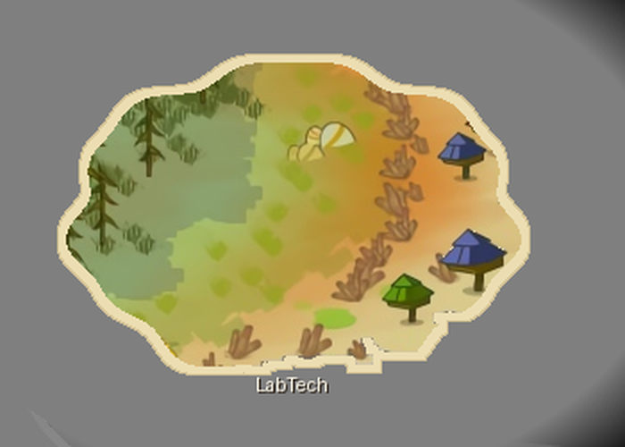
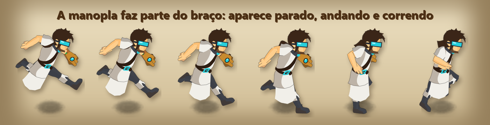
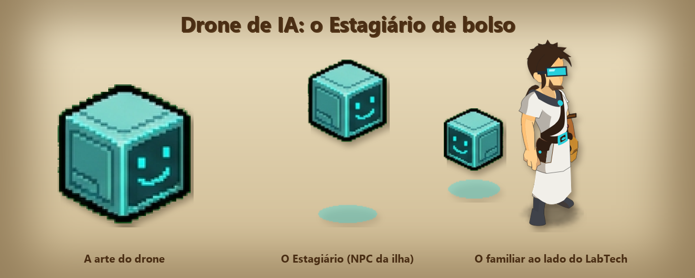

# Dofus LabTech



Um servidor **local** de Dofus Retro 1.39.8, para jogar sozinho ou com amigos no seu próprio PC, com um mundo
novo feito do zero: a **classe LabTech** (13ª classe), uma ilha própria, NPCs, missões, lojas e um painel web para
controlar tudo.

Os LabTechs são inventores que não aceitaram receber poder "de mão beijada" dos deuses. Eles construíram o próprio
poder: uma Manopla Gambiarra com doze núcleos, um jaleco manchado de graxa e cerveja artesanal feita com as próprias mãos.

> **Aviso:** projeto de fã, sem fins lucrativos, sem relação com a Ankama. Dofus é marca registrada da Ankama.
> Este repositório **não contém o jogo** nem arquivos da Ankama. Para jogar, você precisa da sua própria cópia do
> cliente Dofus Retro 1.39.8. Tudo o que modifica o jogo é aplicado só no seu computador.

---

## O que vem no pacote

> Guias completos: **[A história e todas as falas](docs/HISTORIAS.md)**, **[A Ilha LabTech](docs/ILHA_LABTECH.md)** (mapas, missão, cervejas, NPCs, bar das celebridades, segredos) e **[A classe LabTech](docs/CLASSE_LABTECH.md)** (história, visual, feitiços, kit e todos os itens com atributos).

- **Classe LabTech** (masculino e feminino). Nasce de jaleco e visor, com a Manopla e a caneca de cerveja, e aprende
  os feitiços das 12 classes conforme sobe de nível. O livro de feitiços mostra o nível de cada um, e `.raca iop`
  (ou outra classe) monta a barra de feitiços daquela raça.
- **Arquipélago LabTech**: laboratório, praça, cervejaria, oficina, estufa, museu, arena, forja do Dofus
  Fermentado e o **Bar das Celebridades**: 20 famosos em versão paródia, cada um com personagem e retrato próprios
  e uma história escrachada de onde veio.
- **Itens próprios**: Manopla Gambiarra Mk I e Mk XII, Caneca da Gambiarra, Drone de IA (familiar), Conjunto
  Jaleco LabTech, cervejas e o Dofus Fermentado.
- **Mercadores em Bonta e Brâkmar**, ao lado do zaap, que vendem todos os itens do jogo.
- **Regras do servidor local**:
  - XP x10, drop x3, kamas x5 e profissões x10;
  - nível máximo 300;
  - itens e conjuntos pedem o nível normal do jogo;
  - inventário sem limite de peso;
  - molho de chaves que não acaba;
  - todos os zaaps liberados.
- **Painel web** (http://127.0.0.1:8080):
  - ligar e desligar o servidor;
  - criar contas e itens;
  - editar atributos;
  - ver e mudar drops;
  - modo escravo, em que os outros personagens seguem o seu;
  - comandos de GM em português;
  - guias do jogo.

## Imagens

| | |
|---|---|
|  |  |
| **Bar das Celebridades**: 20 paródias, cada uma com personagem próprio | **Inventário**: Conjunto Jaleco, Caneca, Manopla e o Drone de IA |
|  |  |
| **Tela de criação**, no mesmo traço das outras classes | **A ilha LabTech** no mapa-mundi |





<sub>Imagens do jogo rodando localmente com este projeto. Dofus e toda a sua arte são da Ankama Games.</sub>

## Requisitos

- Windows 10 ou 11, com uns 6 GB livres.
- [Git](https://git-scm.com/), [Python 3.10+](https://www.python.org/) e [Node.js 22.5+](https://nodejs.org/).
  Se não tiver, abra o PowerShell e rode:
  ```
  winget install Git.Git Python.Python.3.12 OpenJS.NodeJS.LTS
  ```
  Depois feche e abra o terminal de novo.
- O **cliente Dofus Retro 1.39.8** (não incluído).

O instalador baixa sozinho, das fontes oficiais:
- Java 21 (Amazon Corretto);
- MariaDB 11.4;
- Gradle 8.10;
- JPEXS 26.3;
- o servidor [StarLoco](https://github.com/StarLoco), numa versão fixa.

## Instalação

1. **Baixe este repositório:**
   ```
   git clone https://github.com/labtechrafael/dofus.git
   cd dofus
   ```
2. **Coloque o cliente do jogo** na pasta `server\client-starloco`. No fim, este arquivo precisa existir:
   ```
   server\client-starloco\resources\app\retroclient\loader.swf
   ```
   O arquivo `server\COLOQUE_O_CLIENTE_AQUI.txt` mostra a estrutura esperada.
3. **Rode `instalar.bat`** (dois cliques). Na primeira vez leva de 10 a 20 minutos. Ele:
   1. confere o cliente e aponta o jogo para o servidor local;
   2. baixa Java, MariaDB, Gradle e JPEXS para a pasta `runtime`;
   3. baixa o StarLoco e aplica as mudanças do LabTech (`patches/starloco-game.patch`);
   4. cria o banco de dados e as contas `conta1` a `conta8`, com senha `123`;
   5. compila o servidor;
   6. gera o Mundo LabTech e a classe 13 dentro da **sua** cópia do cliente.

   Pode rodar de novo quando quiser: ele pula o que já está pronto.

## Como jogar

1. Dois cliques em **`Iniciar Dofus.bat`**. Ele liga banco, login e jogo e abre o painel no navegador.
2. Espere as três bolinhas do painel ficarem verdes (Banco, Login e Jogo). O jogo leva de 1 a 2 minutos.
3. Abra o jogo pelo painel (Início → "Abrir clientes", até 8 janelas) ou direto em
   `server\client-starloco\resources\app\retroclient\Dofus.exe`.
4. Entre com `conta1` … `conta8`, senha `123`, e escolha o servidor **Eratz**.
5. Crie um personagem **LabTech** (ou qualquer classe). Ele nasce no Laboratório LabTech e já é GM.
6. Para desligar: **`Parar Dofus.bat`**. Ele salva tudo antes.

> As senhas `123` e o servidor sem senha no banco são para uso **só no seu computador**. Não abra as portas do
> servidor para a internet.

### Comandos úteis

| Onde | Comando | O que faz |
|---|---|---|
| Chat | `.raca feca` … `.raca pandawa` | Monta a barra de feitiços com os feitiços daquela classe |
| Console de admin | `ITEM 10207` | Dá o molho de chaves (entra em qualquer masmorra) |
| Console de admin | `ALIGN 1` e depois `HONOR 18000` | Bonta com grau 10 (`ALIGN 2` = Brâkmar) |
| Menu de admin do cliente | (já traduzido) | Níveis, feitiços, teleporte, grupos de monstros, alinhamento… |

Os outros comandos de GM estão no painel, na aba de comandos, traduzidos e separados por categoria.

## Personalizar

Todo o Mundo LabTech sai de um arquivo só: **`panel/world/labtech/content.py`**. Nele ficam os mapas, os NPCs,
os diálogos, os itens e seus atributos, o conjunto, as lojas e as celebridades.

Depois de editar, com o banco ligado, rode:

```
python panel\tools\labtech\build.py
```

Depois reinicie o jogo pelo painel e **feche e abra o cliente**. Se mudou algum texto e o cliente continua
mostrando o antigo, aumente `LANG_VERSION_BUMP` em `build.py` e rode de novo.

As taxas do servidor (XP, drop, kamas, profissão, mapa inicial etc.) ficam em
`server\game\game.config.properties`. O modelo está em `config\game.config.properties`.

## Estrutura

```
instalar.bat, Iniciar Dofus.bat, Parar Dofus.bat
scripts/                   instalador e scripts de liga/desliga
config/                    configurações do servidor (jogo e login)
patches/                   mudanças no código do StarLoco (Java e Lua)
panel/                     painel web (Node.js) e ferramentas
panel/world/labtech/       o Mundo LabTech: content.py e as artes
panel/tools/labtech/       gerador do mundo, da classe 13 e dos patches do cliente
server/                    (criado na instalação) StarLoco + o seu cliente
runtime/                   (criado na instalação) Java, MariaDB, Gradle, JPEXS
```

## Problemas comuns

- **"cliente não encontrado"**: confira se `server\client-starloco\resources\app\retroclient\loader.swf` existe.
- **A classe LabTech ou o mundo novo não aparecem**: feche o cliente de vez e abra de novo, porque ele guarda
  os textos em cache.
- **Porta ocupada (3306, 450, 5555 ou 8080)**: outro programa está usando a porta. Feche-o, ou rode
  `Parar Dofus.bat` e tente de novo.
- **Outra versão do cliente**: os patches foram feitos para a 1.39.8 (loader de 31/01/2023). Em outras versões,
  as artes e o menu podem não encaixar.

## Créditos

- Servidor: [StarLoco](https://github.com/StarLoco), emulador aberto de Dofus 1.39.
- [JPEXS Free Flash Decompiler](https://github.com/jindrapetrik/jpexs-decompiler) (GPL-3.0), usado para
  renderizar e compilar os arquivos Flash do cliente.
- MariaDB, Amazon Corretto e Gradle.
- Dofus e todo o universo do jogo pertencem à Ankama.
