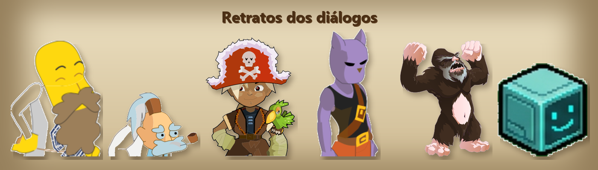

# Arquipélago LabTech


A ilha dos inventores. Fica a leste do continente no mapa-mundi (por volta de **[35..38, -10..-7]**) e é onde todo
personagem novo nasce, no **Laboratório LabTech**. Aqui ninguém recebeu poder dos deuses: tudo foi construído com as
próprias mãos, com gambiarra, ciência e muita cerveja artesanal.

> Tudo o que está nesta página sai de um arquivo só, [`panel/world/labtech/content.py`](../panel/world/labtech/content.py).
> Mudou algo lá? Rode `python panel\tools\labtech\build.py` e reinicie o jogo.

---

## Mapa da ilha

Para andar pela ilha, fale com **O Estagiário**, o drone de IA que fica em quase todos os mapas: ele leva você na hora
para qualquer lugar da ilha, inclusive para os quatro Campos de Teste.

| Mapa | Coord. | O que tem |
|---|---|---|
| **Laboratório LabTech** | 36,-8 | Onde você nasce. Mestre Malte (a missão principal) e o Estagiário. Portas para a Praça, a Oficina, a Cervejaria e o Museu. |
| **Praça da Gambiarra** | 37,-9 | **Zaap** da ilha, a loja da Lúpula e o banco da Dona Levedura. Saídas para os Campos de Teste e a Estufa. |
| **Oficina das Próprias Mãos** | 38,-10 | 14 bancadas de profissão num lugar só: alambique, forno, bigornas, bancadas de joalheiro, sapateiro, escultor, alfaiate, açougueiro, peixeiro, fazendeiro, minerador, lenhador e faz-tudo. |
| **Cervejaria Barril Gambiarra** | 38,-8 | Taverneiro Barril (vende as 6 cervejas), o Encanador Aposentado e o Fliperama da Taverna. Porta para o Bar das Celebridades. |
| **Bar das Celebridades** | 38,-7 | 20 personagens famosos (em versão paródia) que amam cerveja. |
| **Museu dos Experimentos** | 35,-9 | Homenagens a projetos de IA do canal LabTech (veja [Museu](#museu-dos-experimentos)). |
| **Arena LabTech** | 35,-10 | Os chefes mais fortes do jogo aparecem aqui. |
| **Estufa de Lúpulo** | 36,-9 | Seu Lúpulo vende malte, lúpulo e levedura mais baratos. |
| **Campos de Teste 1 a 4** | ao redor da Praça | Monstros por faixa de nível (veja [Campos de Teste](#campos-de-teste)). |
| **Forja do Dofus** | 35,-8 | Onde o Mestre Malte forja o Dofus Fermentado. Lugar secreto: veja [Segredos](#segredos). |

---

## Missão principal: "Com as Próprias Mãos"

1. No Laboratório, fale com o **Mestre Malte**. Pergunte "É perigoso ir sozinho?" e ele entrega a
   **Manopla Gambiarra Mk I**.
2. A Manopla precisa de **12 núcleos**, um de cada classe. Os deuses esconderam as bênçãos nos monstros favoritos
   deles. Cada chefe solta o seu núcleo **sempre** (100%):

   | Núcleo | Chefe | | Núcleo | Chefe |
   |---|---|---|---|---|
   | Feca | Gobball Real | | Ecaflip | Rato Branco |
   | Osamodas | Wa Wabbit | | Eniripsa | Mob Esponja |
   | Enutrof | Escarafeio Dourado | | Iop | Minotororo |
   | Sram | Rato Preto | | Cra | Lorde Corvo |
   | Xelor | Crackler Lendário | | Sadida | Treechnid Ancestral |
   | Sacrier | Vlad Sombrio | | Pandawa | Tanukouï San |

3. Com os 12 núcleos, volte ao Mestre Malte: ele encaixa tudo e entrega a **Manopla Gambiarra Mk XII**
   (+1 PA e alcance até 2).
4. Quer mais? Leve **10 Malte de Primeira, 10 Lúpulo Cítrico e 10 Levedura Selvagem** ao Mestre Malte e ele forja o
   **Dofus Fermentado**. Os dragões chocam os Dofus deles; os LabTechs fermentam o seu.

---

## Cervejas LabTech

Feitas pela profissão **Alquimista**, no alambique da Oficina. Cada cerveja **cura 500 PV** e dá **+100 num atributo
por 30 lutas**. Também servem de comida para o familiar Drone de IA (cada cerveja treina um atributo dele).

| Cerveja | Dá | Receita |
|---|---|---|
| Cerveja Malte Puro | +100 Força | 3 Malte de Primeira + 1 Lúpulo Cítrico + 1 Levedura Selvagem |
| IPA da Gambiarra | +100 Inteligência | receita base + 1 Flor de Linho |
| Stout do Estagiário | +100 Sabedoria | receita base + 1 Aveia |
| Weiss Sem Deus | +100 Agilidade | receita base + 1 Trigo |
| Lager do Loot | +100 Prospecção | receita base + 1 Centeio |
| Pilsen do Trevo | +100 Sorte | receita base + 1 Trevo de Cinco Folhas |

**Onde conseguir os ingredientes:**
- **Lúpula**, na Praça: 30 kamas cada.
- **Seu Lúpulo**, na Estufa: 20 kamas cada.
- Drop nos monstros dos Campos de Teste: Malte 12%, Lúpulo 10% e Levedura 8%, antes da taxa de drop do servidor.

O **Taverneiro Barril** também vende as seis cervejas prontas, por 150 kamas.

---

## Campos de Teste

| Campo | Nível | Monstros |
|---|---|---|
| 1 | 1 a 50 | Gobball, Tofu, Larvas, Corvo, Biblops, Cogu Cogu, Crackler das Planícies, Aracne Adulta |
| 2 | 50 a 100 | Dragonetes (Branco, Dourado, Safira e versões Alerta), Kaniger, Serpente, Rato Hioativo, Piralak |
| 3 | 100 a 150 | Pikoko do Ar, Snailmet, Trool, Mestre Koalak, Cheeken, Treeckler Leve, Mushnid |
| 4 | 150+ | Cogu Cigu, Cogu Tup e os Fantasmas de Pandala (Pandulum, Leopardo, Raposa Yokai, Pandikaze) |

**Arena LabTech:** Dragão Porco, Tofu Real, Minotororo, Crackler Lendário, Lorde Corvo, Vlad Sombrio, Wa Wabbit,
Treechnid Ancestral, Perfidious Tynril, Deminobola, Muminotor e Tanukouï San.

---

## O Estagiário e o Drone de IA


O **Estagiário** é a IA do LabTech num drone cúbico com carinha na tela. Ele fica em quase todos os mapas e leva você na hora para qualquer lugar da ilha. Existe também a versão de bolso, o **Drone de IA**: um familiar que flutua ao seu lado e dá +1 PA, +1 PM, +5000 de prospecção e +10 invocações. A Lúpula vende o drone na Praça, e ele se alimenta das cervejas LabTech, cada uma treinando um atributo.

## Personagens da ilha

> Todas as conversas completas, de todos os personagens, estão em **[HISTORIAS.md](HISTORIAS.md)**.

| NPC | Onde | O que faz |
|---|---|---|
| **Mestre Malte** | Laboratório, Forja | A missão da Manopla e o Dofus Fermentado. Conta a origem dos LabTechs. |
| **O Estagiário** | quase todos os mapas | Drone de IA com carinha na tela. Teleporta você pela ilha inteira. |
| **Lúpula** | Praça | Vende ingredientes, o Conjunto Jaleco LabTech, a Caneca da Gambiarra e o Drone de IA. |
| **Dona Levedura** | Praça | Banco. |
| **Taverneiro Barril** | Cervejaria | Vende as cervejas e ensina as receitas. |
| **Encanador Aposentado** | Cervejaria | Aposentou-se de resgatar princesas; agora conserta os canos da cervejaria. |
| **Fliperama da Taverna** | Cervejaria | INSERT COIN. E dá uma dica de segredo. |
| **Seu Lúpulo** | Estufa | Ingredientes mais baratos. |
| **Juiz da Arena** | Arena | Explica a arena e dá dicas de luta. |

### Museu dos Experimentos

Homenagens a projetos de inteligência artificial do canal LabTech:

- **Dino da Bazuca**: o dinossauro do navegador sem internet, treinado com NEAT até aprender sozinho (e ganhar uma bazuca).
- **Os 3 Cérebros**: NEAT, DQN e PPO, e a diferença entre treinar na simulação e jogar de verdade.
- **Boto Detetive**: a IA que olha a água e responde "boto" ou "não boto".
- **Tofu Bate-Asas**: o jogo controlado balançando os braços na frente da webcam.
- **Vaca Aerodinâmica**: evolução num túnel de vento virtual para ganhar de uma Ferrari.

### Bar das Celebridades


Vinte famosos que amam cerveja, cada um com um personagem próprio que lembra o original. Todos são paródias:
- Bigodix, o Gaulês;
- Pedrix, Carregador de Menires;
- Homero Simplório;
- Mané do Balcão;
- Charlinho Brilho;
- Leôncio Violeiro;
- Zé do Pagode;
- Thor;
- Pedrão Grifo;
- Barnabé Arroto;
- Homem-Barril;
- Capitão Bacalhau;
- Capitão Pardal;
- Tirino, o Estrategista;
- Grandão Guarda-Caça;
- Gimbo, o Anão;
- Ragnar;
- Gatão da Destruição;
- Dionísio;
- Rique Sanches.

Converse com todos: cada um tem a sua história e pelo menos uma pergunta extra.



---

## Fora da ilha: Mercadores LabTech

Ao lado do **zaap de Bonta** e do **zaap de Brâkmar** fica um Mercador LabTech que vende **todos os itens do jogo**
(mais de 10 mil), separados por prateleira. Escolha a seção no diálogo (Equipamentos, Armas, Poções, Recursos…) e a
janela de compra abre na hora. Dá para comprar qualquer item, mas para equipar vale o nível normal de cada um.

---

## Segredos

<details>
<summary>Spoiler: como chegar na Forja do Dofus</summary>

No **Laboratório** (ou na Oficina, na Cervejaria ou no Museu), digite no chat o código mais famoso dos videogames:

```
.cima cima baixo baixo esquerda direita esquerda direita b a
```

</details>
